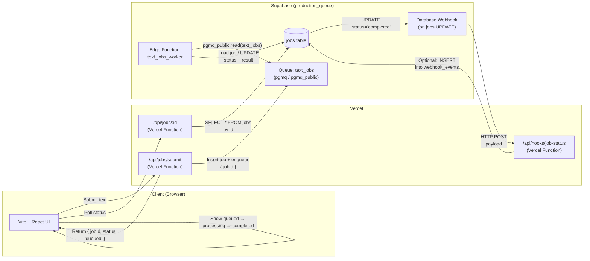

# production_queue Demo

This is a demonstration project showing how to integrate **Supabase
Queues**, **Supabase Edge Functions**, and **Supabase Database
Webhooks** with a **Vercel-hosted Vite (React) frontend**.

The project showcases an end‑to‑end async workflow: 1. User submits text
from the frontend. 2. Vercel backend writes a `jobs` row and pushes a
message into a Supabase Queue. 3. A Supabase Edge Function consumes the
queued message, processes the text, and updates the job. 4. A Supabase
Database Webhook triggers when the job is completed. 5. Frontend polls
job status until complete.

------------------------------------------------------------------------

## Features

-   **Vite + React Frontend** (deployed on Vercel)\
-   **Vercel API Routes** for job submission and retrieval\
-   **Supabase Queue** (`text_jobs`) to manage async workloads\
-   **Supabase Edge Function** (`text_jobs_worker`) for processing\
-   **Database Webhook** that POSTs to a Vercel route on updates\
-   **Simple UI**: text input, status box, results box

------------------------------------------------------------------------

## Repository Structure

    /
      api/
        jobs/
          submit.ts          # POST /api/jobs/submit
          [id].ts            # GET /api/jobs/:id
        hooks/
          job-status.ts      # POST webhook receiver
        _supabaseClient.ts   # Shared server-side Supabase client
      supabase/
        functions/
          text_jobs_worker/
            index.ts         # Edge Function worker
        sql/
          create_jobs.sql    # jobs table schema
      src/
        App.tsx              # Main UI
        main.tsx             # React bootstrap
      README.md
      PRD.md

------------------------------------------------------------------------

## Supabase Setup

### 1. Enable Queues

In the Supabase Dashboard → **Integrations → Queues**: - Enable
**Queues** - Enable `pgmq` extension - Create queue: **text_jobs** -
Enable **Expose Queues via PostgREST** (creates `pgmq_public`).

### 2. Create `jobs` Table

Run:

``` sql
create table if not exists public.jobs (
  id uuid primary key default gen_random_uuid(),
  input_text text not null,
  status text not null check (status in ('queued','processing','completed','error')),
  result text,
  error_message text,
  created_at timestamptz not null default now(),
  updated_at timestamptz not null default now()
);
```

### 3. Optional: Create Webhook Events Table

``` sql
create table if not exists public.webhook_events (
  id bigserial primary key,
  payload jsonb not null,
  created_at timestamptz not null default now()
);
```

### 4. Create Database Webhook

Supabase Dashboard → **Database → Webhooks → Create Webhook**

-   Table: `jobs`
-   Event: `UPDATE`
-   URL: `https://<your-vercel-domain>/api/hooks/job-status`
-   Optional secret header (store in Vercel env as
    `SUPABASE_WEBHOOK_SECRET`)

### 5. Deploy Edge Function

    supabase functions deploy text_jobs_worker --project-ref <project-ref>

Invoke manually for testing:

    supabase functions invoke text_jobs_worker

------------------------------------------------------------------------

## Vercel Environment Variables

Set in Vercel → Project → Settings → Environment Variables:

  Name                          Value
  ----------------------------- ----------------------------------------
  `SUPABASE_URL`                https://`<project>`{=html}.supabase.co
  `SUPABASE_SERVICE_ROLE_KEY`   Supabase service key
  `SUPABASE_WEBHOOK_SECRET`     (optional) match the webhook secret
  `SAVE_WEBHOOK_EVENTS`         true (optional)

If frontend directly uses Supabase: - `VITE_SUPABASE_URL` -
`VITE_SUPABASE_ANON_KEY`

------------------------------------------------------------------------

## Running Locally

### 1. Start Supabase locally

    supabase start

### 2. Run Vite frontend + Vercel backend

    npm install
    vercel dev

### 3. Test the workflow

1.  Open `http://localhost:3000`
2.  Enter text → submit\
3.  Check `supabase.functions invoke text_jobs_worker` (or cron)\
4.  Watch UI transition: **queued → processing → completed**

------------------------------------------------------------------------

## Testing Backend Endpoints with curl

### Start local development server

```bash
supabase start
npm install
vercel dev
```

The Vercel dev server runs on `http://localhost:3000` by default.

### 1. Submit a Job

```bash
curl -X POST http://localhost:3000/api/jobs/submit \
  -H "Content-Type: application/json" \
  -d '{"text": "hello world"}'
```

Response (201):
```json
{
  "jobId": "550e8400-e29b-41d4-a716-446655440000",
  "status": "queued"
}
```

Save the `jobId` for the next commands.

### 2. Check Job Status

```bash
curl http://localhost:3000/api/jobs/550e8400-e29b-41d4-a716-446655440000
```

Response (200):
```json
{
  "id": "550e8400-e29b-41d4-a716-446655440000",
  "text_input": "hello world",
  "status": "queued",
  "result": null,
  "error_message": null,
  "created_at": "2025-01-01T12:00:00Z",
  "updated_at": "2025-01-01T12:00:00Z",
  "processed_at": null
}
```

### 3. Process the Job

Manually invoke the Edge Function to process queued messages:

```bash
supabase functions invoke text_jobs_worker
```

Then check job status again:

```bash
curl http://localhost:3000/api/jobs/550e8400-e29b-41d4-a716-446655440000
```

After processing, status should be `completed` with a result.

### 4. Test Error Handling

Submit invalid text (empty):
```bash
curl -X POST http://localhost:3000/api/jobs/submit \
  -H "Content-Type: application/json" \
  -d '{"text": ""}'
```

Response (400):
```json
{
  "error": "Text cannot be empty"
}
```

Submit text exceeding limit (>10000 chars):
```bash
curl -X POST http://localhost:3000/api/jobs/submit \
  -H "Content-Type: application/json" \
  -d "{\"text\": \"$(python3 -c 'print("x" * 10001)')\"}"
```

Response (400):
```json
{
  "error": "Text exceeds maximum length of 10000 characters"
}
```

### 5. Test Webhook Receiver (Manual)

```bash
curl -X POST http://localhost:3000/api/hooks/job-status \
  -H "Content-Type: application/json" \
  -d '{
    "type": "UPDATE",
    "record": {
      "id": "550e8400-e29b-41d4-a716-446655440000",
      "status": "completed",
      "result": "HELLO WORLD"
    }
  }'
```

Response (200):
```json
{
  "success": true
}
```

------------------------------------------------------------------------

## Acceptance Criteria

-   Jobs transition through states: `queued → processing → completed`.
-   Queue messages are properly consumed.
-   Edge Function processes messages and updates `jobs`.
-   Webhook POSTs to Vercel when `status='completed'`.
-   UI accurately displays status + processed result.

------------------------------------------------------------------------

## Additional Documentation

See `PRD.md` for the full product requirements document.

------------------------------------------------------------------------


# production_queue Architecture Diagram (Mermaid)


